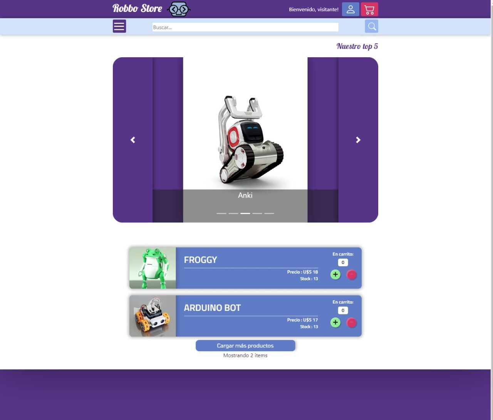
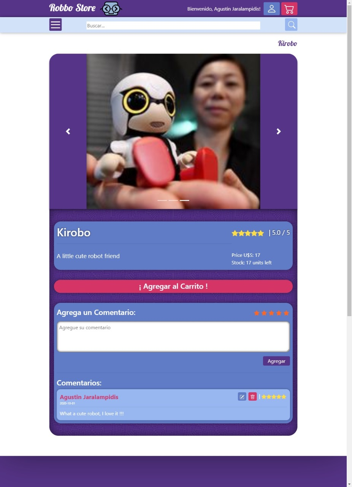
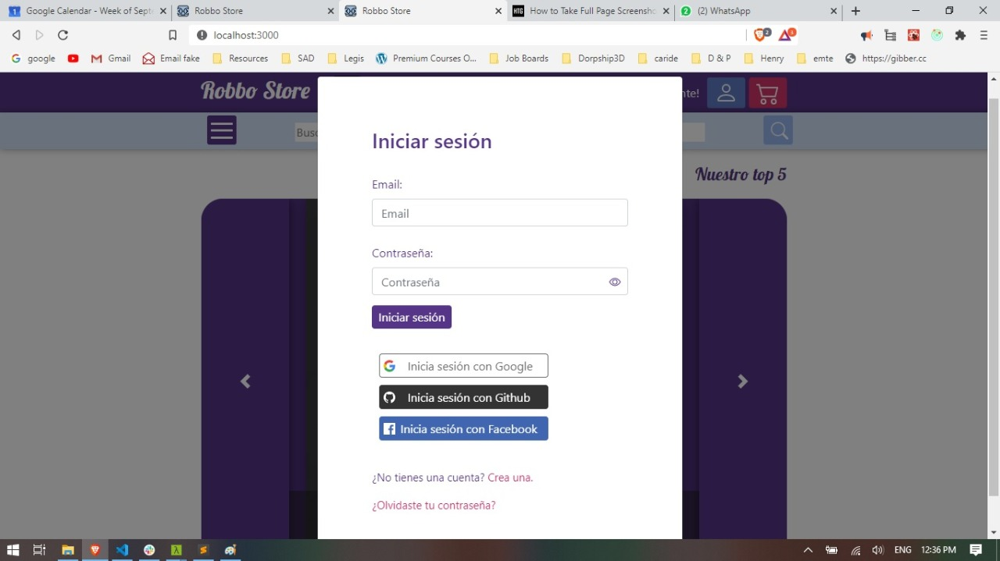
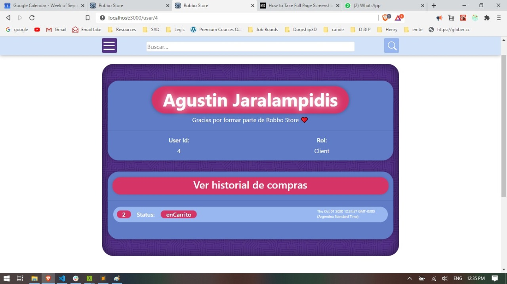
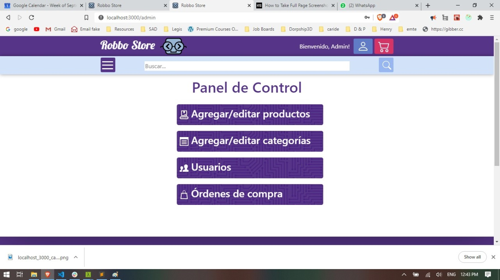
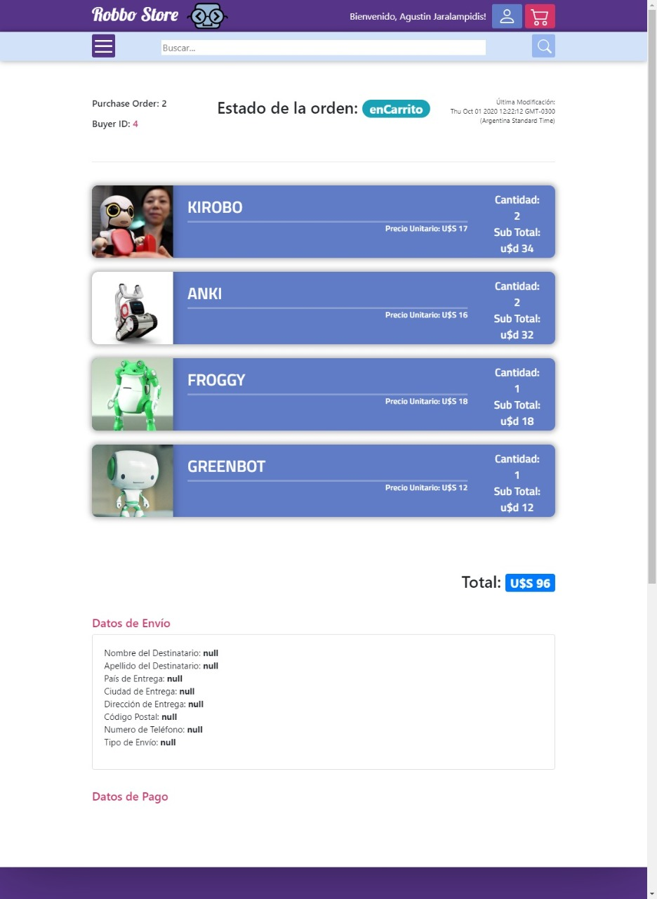
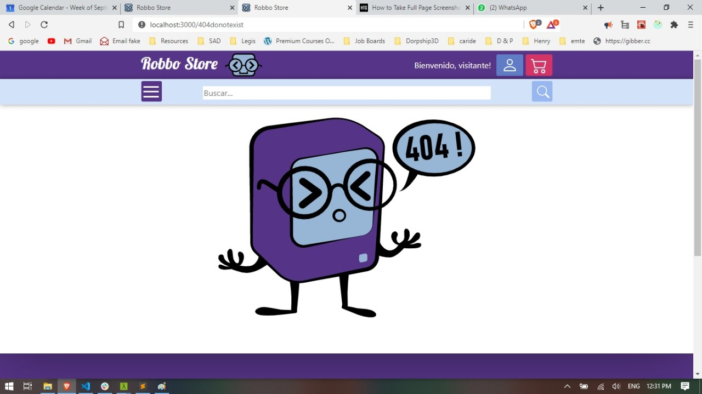

<p align='left'>
    
</p>

# Henry


## Robbo Store

This is a student project we made as part of our education at [Soy Henry](https://www.soyhenry.com/), which consisted of creating a full-stack React application from scratch.

### Our stack of technologies:

- Front End:
    + HTML - CSS - Javascript
    + React
    + React-Bootstrap
    + Redux

- Back End:
    + Node.js
    + Express
    + Passport
    + Sequelize

- Database: 
    + PostgreSQL

# How to start the project:

If you want to see the page for yourself, you'll need to do the following:

- Clone the repository
- Create a `.env` file in the `client` folder with the following contents: 
```
REACT_APP_API_URL=http://localhost:3001
```

- Install [PostgreSQL](https://www.postgresql.org/) on your computer and create a database called `development`.
- Head to the [Google](https://console.developers.google.com/projectselector2/apis/dashboard?supportedpurview=project), [Facebook](https://developers.facebook.com/) and [Github](https://github.com/settings/developers) developer consoles to obtain your OAuth keys. If you're unfamiliat with the process, you can find some helpful guides [here](https://developers.google.com/fit/android/get-api-key), [here](https://theonetechnologies.com/blog/post/how-to-get-facebook-application-id-and-secret-key) and [here](https://docs.github.com/en/free-pro-team@latest/github/authenticating-to-github/creating-a-personal-access-token#creating-a-token).

- Sign up with [Mailgun](https://www.mailgun.com/) and obtain an API key.

- Create a `.env` file in in the `api` folder with the following contents:
```
DB_USER={Your postgreSQL user}
DB_PASSWORD={Your postgreSQL password}
DB_HOST=localhost

passportSecret={Anything you want}

googleClientID={Your Google OAuth ID}
googleClientSecret={Your Google OAuth secret}

githubClientID={Your Github OAuth ID}
githubClientSecret={Your Github OAuth Secret}

facebookClientID={Your Facebook OAuth ID}
facebookClientSecret={Your Facebook OAuth secret}

mailgunApiKey={Your Mailgun API key}
mailgunDomain={Your Mailgun domain}
```

The app doesn't have any products or users created by default, you'll have to add them yourself! In order to do so, you'll have to log in as an admin. The default admin is:

```
Email: admin@admin.com
Password: admin
```


# Previews

### Home page:



### Product Page:


### Login:


### User Profile:


### Admin Control Panel:


### Purchase Order:


### 404 Page:
